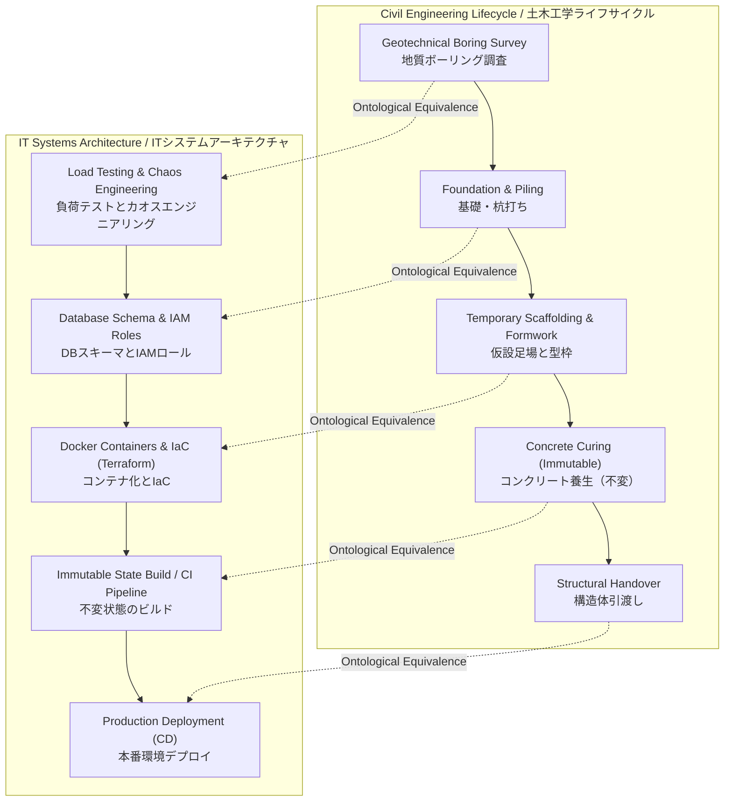

  <h1>Mapping Civil Engineering Heuristics to IT Systems Architecture</h1>
  <h3>土木工学のヒューリスティックからITシステムアーキテクチャへのマッピング</h3>

 

> **Document ID:** `02-02-SKILL-ONTOLOGY` 
> **Module:** 02. Foundations and Ontology 
> **Author:** Jericho Ong / ジェリコ・オング (Construction & Logistics DX Independent Researcher) 
> **Language:** English / Japanese (Advanced Business Keigo / 最高敬語)

---

## Executive Summary / 概要

The transition from overseeing massive physical infrastructure to engineering enterprise digital systems is not a departure from established engineering principles; it is a direct algorithmic translation. The foundational premise of this framework is that large-scale civil engineering project management is, mathematically and operationally, a highly complex distributed systems problem. Orchestrating the concurrent movements of over 1,000 multi-disciplinary field personnel, coordinating heavy machinery, and managing infrastructural budgets exceeding 700 Million JPY requires the exact same heuristic logic, risk mitigation, and systemic resource allocation as designing distributed cloud architectures and API microservices. 

> 大規模な物理的インフラストラクチャの監督からエンタープライズ・デジタルシステムの構築への移行は、確立された工学の原則からの逸脱ではございません。それは直接的なアルゴリズムへの翻訳でございます。本フレームワークの根本的な前提は、大規模な土木工学のプロジェクト管理が、数学的かつ運用的に「極めて複雑な分散システムの問題」であるということでございます。1,000名を超える多分野にわたる現場スタッフの同時進行する動きを調整し、重機を連携させ、7億円を超えるインフラ予算を管理することは、分散型クラウドアーキテクチャやAPIマイクロサービスを設計することと全く同じ、ヒューリスティックな論理、リスク軽減、およびシステム的なリソース割り当てを必要といたします。

Digital Transformation (DX) in heavy industry routinely fails when pure IT engineers attempt to build software systems without comprehending the physical "Ground Truth" of a highly volatile construction site. By structurally mapping civil engineering constraints directly into IT architecture protocols, we architect resilient, fault-tolerant digital networks. The cognitive framework developed over 13 years of neutralizing physical bottlenecks serves as the exact blueprint required to engineer zero-latency data pipelines, event-driven architectures, and highly available cloud infrastructures optimized for the rigorous constraints of Japan's MLIT i-Construction mandates.

> 重工業におけるデジタルトランスフォーメーション（DX）は、純粋なITエンジニアが、変動の激しい建設現場の物理的な「グラウンド・トゥルース（現場の真実）」を理解せずにソフトウェアシステムを構築しようとした際に頻繁に失敗いたします。土木工学の制約をITアーキテクチャプロトコルに構造的に直接マッピングすることで、私たちは回復力があり、フォールトトレラント（耐障害性）なデジタルネットワークを設計いたします。物理的なボトルネックを無効化してきた13年間に培われた認知的フレームワークは、国土交通省のi-Constructionの厳格な要件に最適化された、ゼロレイテンシのデータパイプライン、イベント駆動型アーキテクチャ、および高可用性クラウドインフラストラクチャを設計するために必要な、まさに正確な青写真として機能するのです。

---

## 1. Logistical Throughput and Event-Driven Asynchronous Queuing / 物流スループットとイベント駆動型非同期キューイング

In the physical domain of civil engineering, throughput is defined by the logistical capacity to move massive raw materials (concrete, structural steel) into an active work zone without causing spatial congestion. If asynchronous delivery trucks arrive faster than the tower cranes can hoist the materials, a severe physical bottleneck occurs, resulting in total production halting and idle labor—the exact metrics penalized by Japan's 2024 Problem. 

> 土木工学の物理的領域において、スループット（処理能力）は、空間的な混雑を引き起こすことなく、膨大な原材料（コンクリート、構造用鋼）をアクティブな作業ゾーンに移動させるための物流能力によって定義されます。非同期の配送トラックがタワークレーンの資材吊り上げ速度よりも早く到着した場合、深刻な物理的ボトルネックが発生し、生産の完全な停止と遊休労働力を引き起こします。これはまさに、日本の「2024年問題」においてペナルティの対象となる指標でございます。

In IT systems architecture, this physical traffic phenomenon translates perfectly to Event-Driven Architecture (EDA) and asynchronous message queuing (e.g., Apache Kafka, AWS SQS, or Google Cloud Pub/Sub). A physical staging area acts as a dead-letter queue for delayed materials. Just as a construction Project Manager must implement strict Just-In-Time (JIT) delivery protocols to regulate physical payload arrival, a Systems Architect deploys load balancers and Pub/Sub topics to decouple data producers (IoT Edge sensors) from data consumers (Cloud AI engines), ensuring systemic stability even during massive telemetry traffic spikes.

> ITシステムアーキテクチャにおいて、この物理的なトラフィック現象は、イベント駆動型アーキテクチャ（EDA）および非同期メッセージキューイング（Apache Kafka、AWS SQS、Google Cloud Pub/Subなど）へと完璧に変換されます。物理的な資材置き場は、遅延した資材のためのデッドレターキューとして機能いたします。建設プロジェクトマネージャーが物理的なペイロードの到着を調整するために厳格なジャスト・イン・タイム（JIT）配送プロトコルを実施しなければならないのと全く同様に、システムアーキテクトはロードバランサーとPub/Subトピックを展開し、データプロデューサー（IoTエッジセンサー）とデータコンシューマー（クラウドAIエンジン）を切り離すことで、膨大なテレメトリトラフィックのスパイク時においてもシステムの安定性を確保いたします。

---

## 2. Temporary Works as Infrastructure as Code (IaC) / インフラストラクチャ・アズ・コード（IaC）としての仮設工事

A massive civil engineering structure cannot be built in thin air; it requires extensive temporary works—scaffolding, formwork, and shoring. These temporary structures provide the geometric mold and safety platform required to pour the permanent concrete structure. Once the concrete reaches optimal compressive strength, the scaffolding is systematically dismantled and removed.

> 大規模な土木構造物は空中に建設することはできません。足場、型枠、支保工といった広範な「仮設工事」が必要となります。これらの仮設構造物は、恒久的なコンクリート構造物を打設するために必要な幾何学的な型と安全プラットフォームを提供いたします。コンクリートが最適な圧縮強度に達すると、足場は体系的に解体され、撤去されます。

This heuristic maps directly to **Infrastructure as Code (IaC)** (e.g., Terraform, Ansible) and containerization (e.g., Docker, Kubernetes). In modern cloud engineering, servers are no longer treated as permanent hardware; they are ephemeral (temporary) execution environments. We write Terraform scripts to automatically "erect the scaffolding" (provision the virtual networks and Kubernetes pods). Once the software application (the concrete) is executed and the data is safely committed to the database, the container is destroyed. Managing temporary site logistics requires the identical lifecycle logic as managing ephemeral cloud infrastructure.

> このヒューリスティックは、**インフラストラクチャ・アズ・コード（IaC）**（Terraform、Ansibleなど）およびコンテナ化（Docker、Kubernetesなど）に直接マッピングされます。現代のクラウドエンジニアリングにおいて、サーバーはもはや恒久的なハードウェアとしては扱われず、エフェメラル（短命・一時的）な実行環境として扱われます。Terraformスクリプトを記述して自動的に「足場を組み立て」（仮想ネットワークとKubernetesポッドをプロビジョニングし）ます。ソフトウェアアプリケーション（コンクリート）が実行され、データがデータベースに安全にコミットされると、コンテナは破棄されます。一時的な現場物流の管理は、短命なクラウドインフラストラクチャの管理と全く同一のライフサイクル論理を必要とするのです。

---

## 3. Structural Redundancy and High Availability (HA) Failovers / 構造的冗長性と高可用性（HA）フェイルオーバー

In heavy civil engineering, structures are designed mathematically with a rigorous Factor of Safety (FoS). Load-bearing columns and deep foundation piles are engineered to withstand forces vastly exceeding standard operational loads (e.g., seismic activity or typhoons). This structural redundancy ensures that if one specific node (a singular beam) fractures, the kinetic load is instantly redistributed to adjacent nodes, preventing catastrophic structural collapse.

> 重土木工学において、構造物は厳密な安全率（FoS）を用いて数学的に設計されます。耐荷重柱や深礎杭は、標準的な運用荷重（例：地震活動や台風）をはるかに超える力に耐え得るよう設計されます。この構造的冗長性により、特定のノード（単一の梁）が破壊された場合でも、動的荷重が瞬時に隣接するノードに再分配され、壊滅的な構造崩壊を防ぐことが保証されます。

This physical law dictates the core design principle of **High Availability (HA) Cloud Architecture**. A robust digital twin cannot be hosted on a single server (a single point of failure). The system must be engineered across multiple cloud Availability Zones (Multi-AZ). If a server rack in Tokyo goes offline due to a power failure, the Elastic Load Balancer (ELB) instantaneously routes the traffic to the redundant server rack in Osaka. The mathematical calculus used to design seismic redundancy in a physical bridge is functionally equivalent to designing multi-region failover protocols in enterprise network architecture.

> この物理法則は、**高可用性（HA）クラウドアーキテクチャ**の中核となる設計原則を規定いたします。堅牢なデジタルツインは、単一のサーバー（単一障害点）でホストすることはできません。システムは、複数のクラウド・アベイラビリティゾーン（マルチAZ）にまたがって設計されなければなりません。東京のサーバーラックが停電によりオフラインになった場合、Elastic Load Balancer（ELB）が瞬時にトラフィックを大阪の冗長サーバーラックにルーティングいたします。物理的な橋梁における耐震冗長性を設計するために使用される数学的計算は、エンタープライズ・ネットワーク・アーキテクチャにおいてマルチリージョンのフェイルオーバー・プロトコルを設計することと機能的に等価でございます。

---
## 4. Lifecycle Ontological Mapping / ライフサイクルのオントロジー的マッピング

The following logical diagram establishes the step-by-step ontological equivalence between the physical Civil Engineering lifecycle and the IT Software Development Life Cycle (SDLC) / CI/CD pipeline.

> 以下の論理図は、物理的な土木工学のライフサイクルと、ITのソフトウェア開発ライフサイクル（SDLC）およびCI/CDパイプラインとの間の、段階的なオントロジー的等価性を確立するものでございます。

## 5. Perimeter Integrity and IAM Zero-Trust / 境界の完全性とIAMゼロトラスト

The architecture of site safety relies entirely on absolute physical perimeter control. Heavy steel fencing and rigorous identification checkpoints at the gate (KYK / Hazard Prediction meetings) form an analog Zero-Trust framework. A worker authorized for general excavation is strictly barred from accessing the high-voltage electrical staging area. 

> 現場の安全性のアーキテクチャは、絶対的な物理的境界管理に完全に依存しております。強固な鋼製のフェンスと、ゲートにおける厳格な身元確認チェックポイント（KYK / 危険予知活動）は、アナログの「ゼロトラスト」フレームワークを形成いたします。一般的な掘削作業を許可された作業員は、高圧電気の資材置き場へのアクセスを厳格に禁止されます。

In cloud architecture, this maps perfectly to **Identity and Access Management (IAM)** and **Role-Based Access Control (RBAC)**. The physical gate pass is the cryptographic JWT (JSON Web Token). A digital breach of an unsecured API endpoint results in lateral network movement and ransomware deployment. Therefore, comprehensive IT security is approached as a structural requirement. The access control logic utilized by veteran Project Managers maps seamlessly to the subnet isolation and Zero-Trust metrics rigorously mandated within the Information-technology Promotion Agency (IPA) cybersecurity standards.

> クラウドアーキテクチャにおいて、これは**アイデンティティおよびアクセス管理（IAM）**と**ロールベースアクセス制御（RBAC）**に完璧にマッピングされます。物理的なゲートパスは暗号化されたJWT（JSON Web Token）に相当いたします。保護されていないAPIエンドポイントへのデジタルな侵害は、ネットワーク内のラテラルムーブメントとランサムウェアの展開をもたらします。したがって、包括的なITセキュリティは構造的要件としてアプローチされます。ベテランのプロジェクトマネージャーによって利用されるアクセス制御の論理は、情報処理推進機構（IPA）のサイバーセキュリティ基準で厳格に義務付けられているサブネットの分離やゼロトラストの指標にシームレスにマッピングされるのです。

---

## 6. Algorithmic Lexicon: The Unified Engineering Language / アルゴリズム語彙集：統合エンジニアリング言語

To definitively prove that 13 years of Site Management experience mathematically equips an engineer to architect enterprise cloud networks, the following Lexicon formally maps physical field operations directly into advanced Information Technology nomenclature.

> 13年間の現場管理経験が、エンジニアにエンタープライズクラウドネットワークを構築する能力を数学的に与えることを決定的に証明するため、以下の語彙集では、物理的な現場作業を高度な情報技術の専門用語へ直接かつ正式にマッピングいたします。

| Physical Construction Heuristic (物理的な建設のヒューリスティック) | IT Systems Architecture Equivalent (ITアーキテクチャの対応概念) | Definitional Logic & Engineering Mapping (定義論理とエンジニアリングマッピング) |
| :--- | :--- | :--- |
| **Material Staging Area** (資材置き場 / ヤード) | **Kafka Event Queue / Dead Letter Queue** (イベントキュー / デッドレターキュー) | A structural holding zone designed to prevent systemic processing blockages by smoothing out the highly volatile, unpredictable arrival rates of incoming logistical assets. |
| **Temporary Scaffolding & Formwork** (仮設足場および型枠) | **Infrastructure as Code / Docker Containers** (IaC / Dockerコンテナ) | Ephemeral, programmable structures deployed temporarily to execute a build state, and automatically destroyed once the permanent application (concrete) is finalized. |
| **Concrete Curing Time** (コンクリート養生) | **Immutable State Transition** (不変の状態遷移) | A strictly timed, chemically bound execution process that cannot be interrupted, modified, or accelerated once it has been algorithmically initiated in the pipeline. |
| **Structural Factor of Safety (FoS)** (構造安全率) | **Multi-AZ High Availability (HA)** (マルチAZ 高可用性) | The deliberate engineering of redundant capacity (steel mass or server nodes) to ensure automatic load-redistribution and fault tolerance during catastrophic stress events. |
| **Site Identification Gate Pass** (新規入場者教育・入場許可証) | **JWT / Role-Based Access Control (RBAC)** (JWT / ロールベースアクセス制御) | Cryptographic authorization ensuring that an entity (human or microservice) only has access to the specific spatial/digital zones required for their designated task. |
| **As-Built Drawing & CAD Revisions** (竣工図とCAD修正) | **Git Version Control / Audit Trail** (Gitバージョン管理 / 監査証跡) | Maintaining an immutable, strictly audited history of structural modifications to ensure the physical building and the digital codebase possess absolute mathematical consistency. |

***

  
<strong>[ END OF DOCUMENT // 02-02-SKILL-ONTOLOGY ]</strong>

