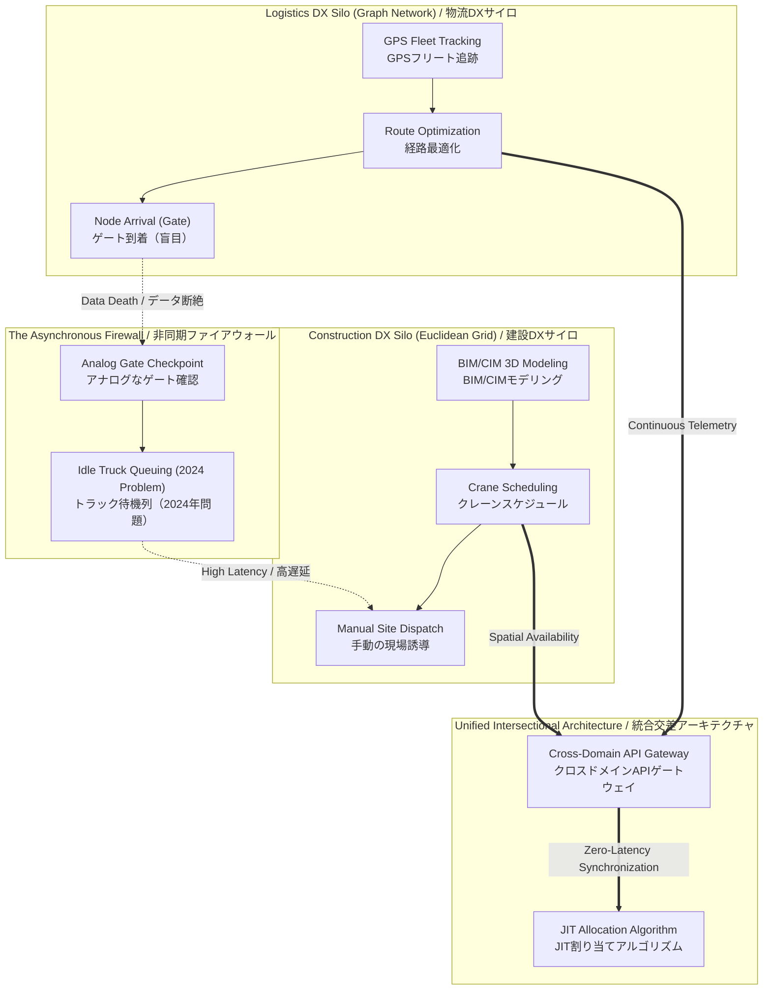

<div align="center">
  <h1>Intersectional Analysis: Construction vs. Logistics DX</h1>
  <h3>建設DXと物流DXの交差分析：非同期データファイアウォールの解体</h3>
</div>

<br>

> **Document ID:** `02-04-INTERSECTION-ANALYSIS`<br>
> **Module:** 02. Foundations and Ontology<br>
> **Author:** Jericho Ong / ジェリコ・オング (Construction & Logistics DX Independent Researcher)<br>
> **Language:** English / Japanese (Advanced Business Keigo / 最高敬語)

---

## Executive Summary / 概要

The systemic inefficiency plaguing the Japanese infrastructure sector—most visibly manifesting as the 2024 Problem—is not rooted in a lack of technology, but in a catastrophic ontological disconnect between two siloed domains: Construction DX and Logistics DX. Construction tech focuses exclusively on optimizing the microscopic Euclidean space inside the perimeter (BIM/CIM, robotics). Logistics tech focuses exclusively on macroscopic graph networks outside the perimeter (fleet routing, GPS). The physical site gate acts as an absolute, asynchronous data firewall where telemetry dies, creating a "data black hole." True Enterprise DX requires the architectural destruction of this firewall through cross-domain API integrations and deterministic, unified state-machines.

> 日本のインフラストラクチャ部門を悩ませているシステム的な非効率性（最も顕著に「2024年問題」として表出しております）は、技術の欠如に起因するものではなく、「建設DX」と「物流DX」という2つのサイロ化された領域間の壊滅的なオントロジーの断絶に根ざしております。建設テクノロジーは、境界内部のミクロ的なユークリッド空間（BIM/CIM、ロボティクス）の最適化に専念しています。一方、物流テクノロジーは、境界外部のマクロ的なグラフネットワーク（フリートのルーティング、GPS）に専念しています。物理的な現場ゲートは、テレメトリーが消滅する絶対的かつ非同期のデータファイアウォールとして機能し、「データのブラックホール」を生み出しております。真のエンタープライズDXには、クロスドメインのAPI統合と決定論的で統一されたステートマシンを通じた、このファイアウォールのアーキテクチャ上の解体が要求されます。

---

## 1. The Epistemological Divide: Graph Networks vs. Euclidean Grids / 認識論的境界：グラフネットワーク 対 ユークリッドグリッド

To mathematically understand the friction at the site gate, we must define the differing data topologies of the two industries. 

Logistics DX operates on a **Topological Graph Network**. A delivery truck is a vector traveling along edges (highways) between nodes (warehouses). The primary optimization metric is Transit Time ($T$). Conversely, Construction DX operates on a **Euclidean 3D Grid** ($X, Y, Z$). A tower crane operates within a strict spatial bounding box. The primary optimization metrics are Spatial Allocation and Structural Tolerances. 

When a logistics vector (a truck) attempts to enter a construction grid (the site), the data formats are mutually incompatible. The logistics software registers the truck as "Arrived at Destination Node," completely blind to the fact that the construction grid's "Unloading Zone C" is currently occupied by a 50-ton crawler crane.

> 現場ゲートにおける摩擦を数学的に理解するためには、2つの業界における異なるデータトポロジーを定義する必要がございます。
> 
> 物流DXは**トポロジカル・グラフネットワーク**上で機能いたします。配送トラックは、ノード（倉庫）間のエッジ（高速道路）を移動するベクトルでございます。主要な最適化指標は移動時間（$T$）です。対照的に、建設DXは**ユークリッド3Dグリッド**（$X, Y, Z$）上で機能いたします。タワークレーンは厳格な空間的バウンディングボックス内で稼働いたします。主要な最適化指標は空間の割り当てと構造的許容誤差でございます。
> 
> 物流ベクトル（トラック）が建設グリッド（現場）に進入しようとする際、双方のデータフォーマットは相互に互換性がございません。物流ソフトウェアはトラックを「目的地ノードに到着」として登録しますが、建設グリッド側の「荷降ろしゾーンC」が現在50トンのクローラークレーンによって占有されているという事実に対しては完全に盲目でございます。

---

## 2. The Physical Gate as an Asynchronous Firewall / 非同期ファイアウォールとしての物理的現場ゲート

This data incompatibility creates the "Asynchronous Firewall." Because the truck's telemetry cannot talk to the crane's operational schedule, a human Project Manager must manually bridge the gap. The truck arrives at the gate, is told to wait on the public road, and the driver goes idle. 

This manual, analog handshake is the exact mechanical root of the 2024 Problem. Time ($t$) is burned waiting for physical space ($X, Y$) to clear. In systems engineering terms, this is a catastrophic blocking operation on a single thread. The Logistics API and the Construction API must be integrated into a unified message broker (e.g., Kafka) to ensure that the physical asset is not dispatched until the destination bounding box evaluates to `Empty` and `Ready`.

> このデータの非互換性が「非同期ファイアウォール」を生み出します。トラックのテレメトリーがクレーンの稼働スケジュールと通信できないため、人間のプロジェクトマネージャーが手動でそのギャップを埋めなければなりません。トラックはゲートに到着し、公道での待機を指示され、ドライバーは遊休状態となります。
> 
> この手動のアナログなハンドシェイクこそが、2024年問題の正確かつ機械的な根本原因でございます。物理的空間（$X, Y$）が空くのを待つために、時間（$t$）が浪費されるのです。システムエンジニアリングの観点から見れば、これは単一スレッドにおける壊滅的なブロッキング操作でございます。物理的資産の配車は、目的地のバウンディングボックスが「空（`Empty`）」かつ「準備完了（`Ready`）」と評価されるまで実行されないよう、物流APIと建設APIは統合されたメッセージブローカー（Kafkaなど）に統合されなければなりません。

---

## 3. Structural Comparison: Siloed vs. Unified Architectures / 構造的比較：サイロ化 対 統合型アーキテクチャ

The following logical diagram illustrates the failure of siloed DX deployments versus the required unified intersectional architecture.

> 以下の論理図は、サイロ化されたDX展開の失敗と、必要とされる統合された交差型アーキテクチャとの比較を示すものでございます。



---

## 4. Sub-Contractor Autonomy vs. Systemic Orchestration / 協力会社の自律性 対 システム的オーケストレーション

Another structural friction point is the distributed nature of heavy construction. A major civil site is not a single enterprise; it is a temporary amalgamation of 50 to 100 independent micro-enterprises (sub-contractors). Each sub-contractor utilizes their own fragmented logistics network to deliver specialized materials (e.g., steel, HVAC, concrete). 

If DX is treated merely as software procurement, each sub-contractor adopts a different SaaS tool, leading to "API Sprawl." The General Contractor (Genekon) loses the ability to orchestrate the global state of the site. Therefore, the Cross-Domain API Gateway must enforce a strict, protocol-agnostic data standard. Regardless of which software a steel supplier uses, their delivery telemetry must be serialized into the unified Protobuf schema before entering the Genekon's digital twin ecosystem.

> もう一つの構造的な摩擦点は、重建設の分散的な性質にございます。大規模な土木現場は単一の企業ではなく、50〜100の独立した零細企業（協力会社）の一次的な集合体でございます。各協力会社は、特殊な資材（鉄骨、空調設備、コンクリートなど）を配送するために、独自に断片化された物流ネットワークを利用しております。
> 
> DXが単なるソフトウェアの調達として扱われた場合、各協力会社が異なるSaaSツールを採用し、「APIスプロール現象（無秩序な乱立）」を招きます。ゼネコン（総合建設業者）は現場全体のグローバル状態を調整する能力を失います。したがって、クロスドメインAPIゲートウェイは、プロトコルに依存しない厳格なデータ標準を強制しなければなりません。鉄骨サプライヤーがどのソフトウェアを使用していようと、その配送テレメトリーは、ゼネコンのデジタルツイン・エコシステムに入る前に、統合されたProtobufスキーマへとシリアライズされる必要がございます。

## 5. Intersectional Lexicon of Friction / 交差領域の摩擦に関する語彙集

To resolve these systemic bottlenecks, we must define the differing terminologies used by both domains and establish the unified systems-engineering resolution.

> これらのシステム的なボトルネックを解決するため、私たちは双方の領域で使用される異なる専門用語を定義し、システムエンジニアリングに基づく統合された解決策を確立しなければなりません。

| Logistics Domain Concept<br>(物流領域の概念) | Construction Domain Concept<br>(建設領域の概念) | Unified Systems Architecture Resolution<br>(統合システムアーキテクチャによる解決策) |
| :--- | :--- | :--- |
| **Node Arrival (Destination)**<br>ノード到着（目的地） | **Site Boundary Perimeter**<br>現場境界線（仮囲い） | **Dynamic Geofence Webhook (動的ジオフェンスWebhook):** Arrival is no longer a static pin, but an API trigger activated when a vehicle breaches a dynamic, BIM-defined spatial polygon. |
| **Fleet Dwell Time**<br>フリート滞留時間 | **Material Waiting Queue**<br>資材搬入待機列 | **Synchronized Execution Thread (同期実行スレッド):** Treating the queue not as physical traffic, but as a thread-blocking error solved via JIT (Just-In-Time) algorithmic dispatching. |
| **Route Pathing (Edges)**<br>経路ルーティング（エッジ） | **Site Access Roads**<br>現場搬入路・仮設道路 | **Unified Flow Topology (統合フロートポロジー):** Expanding the construction site's digital twin to encompass the immediate municipal traffic network, optimizing the "last mile" dynamically. |
| **Proof of Delivery (POD)**<br>配達完了証明（受領書） | **Material Inspection (As-Built)**<br>材料検収（施工管理） | **Immutable Ledger Entry (不変の台帳エントリ):** Replacing paper sign-offs with an automated cryptographic hash confirming the physical spatial transfer of the asset into the construction grid. |

***
<div align="center">
  <p><strong>[ END OF DOCUMENT // 02-04-INTERSECTION-ANALYSIS ]</strong></p>
</div>


## 6. Technical Implementation: Cross-Domain API Routing Logic / 技術的実装：クロスドメインAPIのルーティング論理

To provide immediate educational and technical utility to systems architects, the following pseudo-architecture demonstrates the exact programmatic mechanism required to dismantle the asynchronous firewall. 

Using a Python-based asynchronous gateway (e.g., FastAPI), this routing logic ingests the incoming logistics telemetry (Graph Network data) and validates it against the live structural state of the construction site (Euclidean Grid data) before issuing a physical gate pass.

> システムアーキテクトに即時的な教育的および技術的有用性を提供するため、以下の疑似アーキテクチャは、非同期ファイアウォールを解体するために必要な正確なプログラム的メカニズムを実証するものでございます。
> 
> Pythonベースの非同期ゲートウェイ（FastAPIなど）を使用し、このルーティングロジックは受信した物流テレメトリー（グラフネットワークデータ）を取り込み、物理的な入場許可証（ゲートパス）を発行する前に、建設現場のリアルタイムの構造状態（ユークリッドグリッドデータ）と照合して検証を実行いたします。

```python
# ==============================================================================
# Cross-Domain API Gateway (Construction x Logistics Intersection)
# ==============================================================================
from fastapi import FastAPI, HTTPException
from core.auth import verify_ecdsa_signature
from core.digital_twin import BIM_CIM_Database

app = FastAPI(title="Logistics-to-Construction Synchronization Gateway")
digital_twin = BIM_CIM_Database()

@app.post("/api/v1/gate/arrival-webhook")
async def process_logistics_arrival(payload: bytes):
    """
    Algorithmically processes an incoming transport vehicle using Zero-Trust M2M.
    """
    
    # 1. Deserialize Protobuf & Authenticate (Logistics Domain)
    try:
        truck_telemetry = deserialize_protobuf(payload)
        verify_ecdsa_signature(truck_telemetry.vehicle_id, truck_telemetry.ecdsa_signature)
    except SecurityError:
        raise HTTPException(status_code=403, detail="Zero-Trust Authentication Failed")

    # 2. Query Spatial Availability (Construction Domain)
    # Check if the required 3D bounding box is currently empty and safe
    unloading_zone_state = await digital_twin.get_spatial_status(zone_id="ZONE_C")

    # 3. Deterministic JIT Routing (Intersection Logic)
    if unloading_zone_state.is_occupied:
        # Prevent gridlock: Reroute to external dynamic staging area
        return {
            "status": "DENIED_REROUTE",
            "action": "PROCEED_TO_BUFFER_YARD",
            "dynamic_eta_hold_sec": 600
        }
    else:
        # Orchestrate execution: Lock the spatial grid and open the physical gate
        await digital_twin.lock_spatial_zone(
            zone_id="ZONE_C", 
            locked_by=truck_telemetry.vehicle_id
        )
        return {
            "status": "AUTHORIZED",
            "action": "OPEN_GATE_03",
            "cryptographic_token": generate_jwt_gate_pass()
        }
