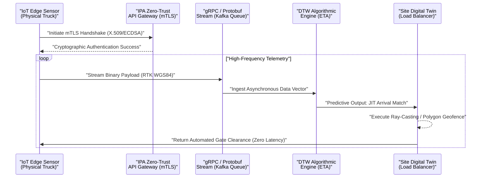

<div align="center">
  <h1>Geospatial and Temporal Data Standards for Logistics Tracking</h1>
  <h3>物流追跡のための地理空間および時間的データ標準</h3>
</div>

<br>

> **Document ID:** `02-03-DATA-ONTOLOGY`<br>
> **Module:** 02. Foundations and Ontology<br>
> **Author:** Jericho Ong / ジェリコ・オング (Construction & Logistics DX Independent Researcher)<br>
> **Language:** English / Japanese (Advanced Business Keigo / 最高敬語)

---

## Executive Summary / 概要

The systemic collapse of the Japanese logistics network—precipitated by the absolute legislative constraints of the 2024 Problem—renders analog ETA (Estimated Time of Arrival) reporting mathematically obsolete. In heavy civil construction, where infrastructural project budgets exceed 700 Million JPY, physical throughput is entirely dependent on the continuous, deterministic synchronization of material delivery. To eliminate the volatile latency delta ($\Delta t$) between physical asset reality and managerial cognitive awareness, this document establishes a rigorous Machine-to-Machine (M2M) telemetry standard. By mandating RTK positioning, gRPC/Protobuf serialization, and Zero-Trust edge authentication, we architect a tracking ontology capable of absorbing supply chain complexity and algorithmically orchestrating site operations.

> 2024年問題という絶対的な法的制約によって引き起こされた日本の物流ネットワークのシステム的崩壊は、アナログな到着予定時刻（ETA）の報告を数学的に時代遅れのものといたしました。インフラプロジェクトの予算が7億円を超える重土木建設において、物理的なスループットは資材配送の継続的かつ決定論的な同期に完全に依存しております。物理的資産の現実と管理者の認知的認識との間に生じる変動の激しいレイテンシのデルタ（$\Delta t$）を排除するため、本ドキュメントは厳密なマシン・ツー・マシン（M2M）のテレメトリー標準を確立いたします。RTK測位、gRPC/Protobufシリアライゼーション、およびゼロトラスト・エッジ認証を義務付けることにより、サプライチェーンの複雑性を吸収し、現場の運用をアルゴリズム的にオーケストレーションする追跡オントロジーを設計いたします。

---

## 1. RTK Positioning and Dynamic Polygon Geofencing / RTK測位と動的ポリゴンジオフェンシング

Standard Global Navigation Satellite System (GNSS) data is architecturally insufficient for enterprise-scale construction logistics due to a Circular Error Probable (CEP) of 3 to 5 meters. This framework mandates the integration of **Real-Time Kinematic (RTK)** positioning. RTK utilizes fixed base stations to broadcast phase corrections to mobile IoT edge devices, compressing the spatial error margin to the sub-centimeter level. 

Furthermore, static radial geofences are inadequate for topologically volatile construction sites. The boundary data structure must utilize dynamic spatial polygons. The cloud architecture continuously ingests spatial shifts from the BIM/CIM matrix. When an RTK-enabled transport vehicle's coordinate vector intersects these boundaries—calculated via computational geometry, specifically the **Point-in-Polygon (Ray-Casting) Algorithm**—it triggers deterministic API webhooks to automatically orchestrate on-site crane and staging area allocations.

> 標準的な全球測位衛星システム（GNSS）のデータは、3〜5メートルの半数必中界（CEP）を持つため、エンタープライズ規模の建設物流にとってはアーキテクチャ上不十分でございます。本フレームワークは、**リアルタイムキネマティック（RTK）**測位の統合を義務付けております。RTKは、固定基地局を利用してモバイルIoTエッジデバイスに位相補正をブロードキャストし、空間的誤差をサブセンチメートルレベルまで圧縮いたします。
> 
> さらに、静的な円形のジオフェンスは、トポロジー的に変動の激しい建設現場には不適切でございます。境界データ構造は動的な空間ポリゴンを利用しなければなりません。クラウドアーキテクチャは、BIM/CIMマトリックスから空間的変動を継続的に取り込みます。RTK対応の輸送車両の座標ベクトルがこれらの境界と交差した際（計算幾何学、特に**Point-in-Polygon（レイキャスティング）アルゴリズム**によって計算）、決定論的なAPI Webhookがトリガーされ、現場のクレーンおよび資材置き場の割り当てが自動的にオーケストレーションされます。

---

## 2. Asynchronous Serialization via Protocol Buffers (gRPC) / プロトコルバッファ（gRPC）を介した非同期シリアライゼーション

Transmitting continuous geospatial telemetry from hundreds of concurrent logistical nodes requires rigorous payload optimization. RESTful APIs transmitting uncompressed JSON payloads introduce severe network overhead and latency spikes due to verbose string encoding. 

To engineer a resilient, low-latency tracking architecture, this framework dictates the adoption of **Protocol Buffers (Protobuf)** transmitted over **gRPC**. Protobuf fundamentally transforms the data standard by serializing the positional vectors into tightly compressed, language-neutral binary streams. 

```protobuf
// Definition of the Standardized Logistics Telemetry Payload
syntax = "proto3";

message LogisticsTelemetry {
  string vehicle_id = 1;         // Cryptographic identifier
  double latitude = 2;           // RTK-corrected WGS84
  double longitude = 3;          // RTK-corrected WGS84
  float velocity_mps = 4;        // Kinematic vector (m/s)
  int64 timestamp_utc = 5;       // Epoch execution time
  bytes ecdsa_signature = 6;     // Edge authentication hash
}
```

This algorithmic compression reduces payload sizes exponentially, enabling bidirectional streaming and ensuring that the site's load-balancing algorithms are fed with high-density, uninterrupted kinematic states.

> 数百の同時進行する物流ノードから継続的な地理空間テレメトリーを送信するには、ペイロードの厳密な最適化が必要となります。非圧縮のJSONペイロードを送信するRESTful APIは、冗長な文字列表現により、深刻なネットワークオーバーヘッドとレイテンシのスパイクをもたらします。
> 
> 回復力のある低レイテンシの追跡アーキテクチャを設計するため、本フレームワークは**gRPC**を介して送信される**プロトコルバッファ（Protobuf）**の採用を規定しております。Protobufは、位置ベクトルを厳密に圧縮された言語依存のないバイナリストリームにシリアライズすることで、データ標準を根本的に変革いたします。（上記コードブロック参照）。このアルゴリズム的圧縮によりペイロードサイズが指数関数的に削減され、双方向ストリーミングが可能となり、現場のロードバランシングアルゴリズムに高密度で途切れることのないキネマティック状態が供給されることが保証されます。

---

## 3. Algorithmic ETA Calculation via Dynamic Time Warping (DTW) / 動的時間伸縮法（DTW）によるアルゴリズム的ETA計算

To neutralize the bottlenecks defined by Japan's 2024 Problem, logistics tracking must transition from static linear velocity equations ($v = d/t$) to predictive, non-linear algorithmic modeling. 

This framework requires the implementation of **Dynamic Time Warping (DTW)** integrated with continuous Machine Learning models. Calculating exact arrival times through dense urban traffic requires analyzing time-series datasets of varying speeds and lengths. DTW algorithms calculate the optimal match between two given sequences with time complexity $O(N \cdot M)$, comparing the inbound truck's real-time telemetry array against thousands of historically successful delivery vectors. This ensures the JIT arrival sequence perfectly aligns with the tower crane availability matrix, eliminating cascading idle failures.

> 日本の2024年問題によって定義されるボトルネックを無効化するため、物流追跡は静的な線形速度方程式（$v = d/t$）から、予測的で非線形なアルゴリズムモデリングへと移行しなければなりません。
> 
> 本フレームワークは、継続的な機械学習モデルと統合された**動的時間伸縮法（DTW）**の実装を必要としております。渋滞の激しい都市部の交通における正確な到着時間を計算するには、速度や長さが異なる時系列データセットを分析する必要がございます。DTWアルゴリズムは、時間計算量$O(N \cdot M)$を用いて2つのシーケンス間の最適な一致を計算し、接近するトラックのリアルタイムのテレメトリー配列と、過去の何千もの成功した配送ベクトルとを比較いたします。これにより、JIT到着シーケンスがタワークレーンの可用性マトリックスと完全に一致し、連鎖的な待機障害が排除されます。

---

## 4. Cryptographic Sovereignty and Edge Authentication (mTLS) / 暗号化の主権とエッジ認証（mTLS）

When a transport vehicle continuously transmits geospatial coordinates to a highly sensitive, ¥700M+ infrastructure project, it becomes a critical node within the enterprise IoT network. Unsecured GPS telemetry is highly susceptible to spoofing attacks, potentially manipulating supply chain scheduling and causing catastrophic physical disruption.

Tracking standards must strictly adhere to the Information-technology Promotion Agency (IPA) cybersecurity baselines. The architecture mandates **Mutual Transport Layer Security (mTLS)** for edge-to-cloud communications. Every physical asset must be cryptographically authenticated via **ECDSA (Elliptic Curve Digital Signature Algorithm)** and X.509 certificates. This Zero-Trust architecture ensures ingested geospatial metrics remain completely immutable, sovereign, and immune to synthetic data injection.

> 輸送車両が、7億円を超える極めて機密性の高いインフラプロジェクトに地理空間座標を継続的に送信する際、それはエンタープライズIoTネットワーク内の重要なノードとなります。保護されていないGPSテレメトリーはスプーフィング攻撃に対して極めて脆弱であり、サプライチェーンのスケジューリングを操作し、壊滅的な物理的混乱を引き起こす可能性がございます。
> 
> 追跡の基準は、情報処理推進機構（IPA）のサイバーセキュリティベースラインに厳密に準拠しなければなりません。アーキテクチャは、エッジ・ツー・クラウド通信に対して**相互トランスポート層セキュリティ（mTLS）**を義務付けております。すべての物理的資産は、**ECDSA（楕円曲線デジタル署名アルゴリズム）**およびX.509証明書を介して暗号学的に認証されなければなりません。このゼロトラストアーキテクチャにより、取り込まれた地理空間メトリクスが完全に不変であり、主権を保ち、合成データの注入に対して免疫を持つことが保証されます。

---

## 5. M2M Telemetry Pipeline Architecture / M2Mテレメトリーパイプライン・アーキテクチャ

The following architecture diagram dictates the strictly sequenced M2M data pipeline, bridging the physical logistics asset to the centralized Digital Twin via Zero-Trust methodologies.

> 以下のアーキテクチャ図は、物理的な物流資産と中央のデジタルツインをゼロトラスト手法を介して橋渡しする、厳密に順序付けられたM2Mデータパイプラインを規定するものでございます。



---

## 6. Geospatial Data Schema Lexicon / 地理空間データスキーマ語彙集

To formalize the integration of Civil Engineering logistics with IT Data Engineering, the following standard maps the required physical inputs into their exact programmatic data types and cryptographic states.

> 土木工学の物流とITデータエンジニアリングの統合を形式化するため、以下の基準は、必要な物理的入力データを正確なプログラム上のデータ型および暗号化状態にマッピングいたします。

| Physical Logistic Variable<br>(物理的な物流変数) | IT Data Type & Schema<br>(ITデータ型とスキーマ) | Architectural Function & Constraints<br>(アーキテクチャ上の機能と制約) |
| :--- | :--- | :--- |
| **Site Boundary Definition**<br>(現場境界の定義) | **GeoJSON Polygon Array**<br>(Float64) | Defines the algorithmic boundary constraint. Must be dynamically updated daily from BIM/CIM spatial models. |
| **Vehicle Geolocation**<br>(車両の地理位置情報) | **RTK WGS84 Coordinates**<br>(Double Precision) | Sub-centimeter positional geometry to prevent spatial ambiguity at narrow urban construction gates. |
| **Asset Identity Validation**<br>(資産の身元検証) | **ECDSA Signature (mTLS)**<br>(Byte Array) | Cryptographic proof ensuring the telemetry packet originated from an authorized vehicle, preventing data spoofing. |
| **Dynamic Routing Metric**<br>(動的ルーティング指標) | **Kinematic Velocity Vector**<br>(Float32 m/s) | Real-time speed and heading data fed continuously into the DTW (Dynamic Time Warping) ETA prediction engine. |
| **Event Chronology**<br>(イベントの時系列) | **Unix Epoch UTC**<br>(Int64) | Absolute, time-zone independent chronological marker ensuring perfect synchronization across all microservices. |

***
<div align="center">
  <p><strong>[ END OF DOCUMENT // 02-03-DATA-ONTOLOGY ]</strong></p>
</div>
