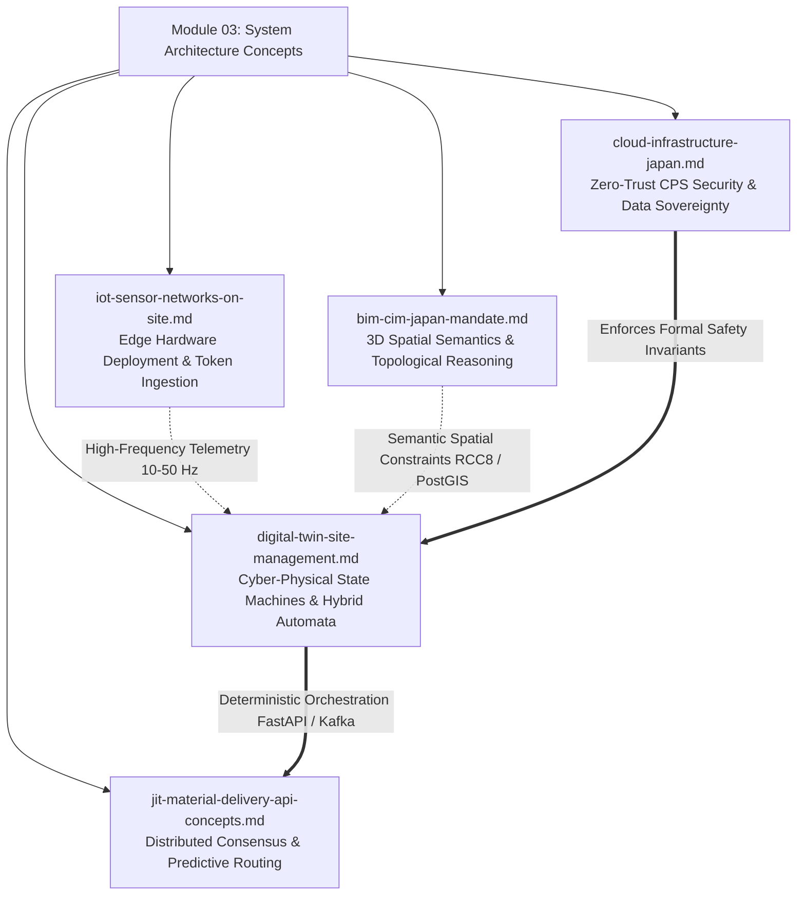

<div align="center">
  <h1>Module 03: System Architecture Concepts</h1>
  <h3>システムアーキテクチャ・コンセプト：サイバーフィジカル統合の青写真</h3>
</div>

<br>

> **Metadata:**
> * **Module ID:** `MOD-03-ARCHITECTURE`
> * **Status:** 🏗️ Under Development / 構築中
> * **Author:** Jericho Ong / ジェリコ・オング (Construction & Logistics DX Independent Researcher)
> * **Language:** English / Japanese (Advanced Technical Business / ビジネス技術日本語)

---

## Executive Summary / 概要

This module formalizes the **Cyber-Physical Architecture Layer (CPAL)** required to transform traditional, non-deterministic construction and logistics operations into self-correcting, safety-guaranteed **Cyber-Physical Systems (CPS)**. Building upon the macro-systemic constraints identified in Module 01 (The 2024 Problem) and the ontological primitives defined in Module 02, this module introduces a **multi-layered, event-driven, and mathematically verifiable architecture** capable of operating within Japan's highly constrained regulatory, spatial, and labor environments.

At the core of this framework is the absolute transition from human-centric, high-latency heuristics (e.g., Morning Assembly / 朝礼 and manual whiteboard planning) to **machine-interpretable operational semantics**. This optimization shift enables:

* Predictive logistics orchestration via non-linear edge modeling.  
* Autonomous, real-time material routing and resource balancing.  
* Continuous spatial conflict avoidance across multi-tiered subcontractor operations.  
* Hardware-rooted, Zero-Trust cyber-physical safety enforcement.

> 本モジュールは、伝統的かつ非決定論的な建設・物流運用を、自己修復型で安全性が保証された**サイバーフィジカルシステム（CPS）**へと変革するために必要な**サイバーフィジカル・アーキテクチャ層（CPAL）**を正式に定義いたします。  
> モジュール01で示されたマクロな構造的制約（2024年問題）と、モジュール02で定義されたオントロジーのプリミティブを基盤とし、日本の厳格な規制・空間・労働制約下において稼働可能な、多層的、イベント駆動型、かつ数学的に検証可能なアーキテクチャを提示します。  
>  
> 本フレームワークの中核は、人間中心の低頻度なヒューリスティック（朝礼や手動のホワイトボード管理など）から、マシンが解釈可能な運用セマンティクスへの完全な移行にございます。この最適化により、以下の機能が実現いたします。  
> * 非線形エッジモデリングによる予測적物流オーケストレーション  
> * 自律的なリアルタイム資材ルーティングとリソース平準化  
> * 多層的な協力会社間の運用における継続的な空間衝突回避  
> * ハードウェアにルートを持つ、ゼロトラスト・サイバーフィジカル安全性の強制執行  

---

## 🧠 Cyber-Physical Architecture Theory / サイバーフィジカル・アーキテクチャ理論

### 1. Cyber-Physical Determinism Model (CPDM) / サイバーフィジカル決定論モデル

To guarantee predictable behavior and structural throughput within a stochastic, partially observable construction environment, the CPAL adopts a formal **Hybrid Automata Model**. This framework models the construction ecosystem by combining continuous physical dynamics with discrete digital state transitions.

Formally, the system state configuration is defined by the tuple:

$$\Sigma = (X, Q, f, \text{Init}, \text{Inv}, E, G, R)$$

Where:

* $X \subseteq \mathbb{R}^n$ represents the **Continuous State Space** (e.g., real-time RTK WGS84 coordinates, velocity vectors, and mechanical load cells).  
* $Q$ represents the discrete **Operational Modes** enumerated within the system ecosystem (`STATE_LOADING`, `STATE_TRANSPORTING`, `STATE_IDLE`, `STATE_ENVIRONMENTAL_LOCK`).  
* $f: Q \times X \rightarrow \mathbb{R}^n$ represents the system of **Differential Equations** governing physical mechanical motion within each mode.  
* $\text{Init}, \text{Inv}$ represent the **Initial Conditions** and **Spatio-Temporal Invariants** (e.g., dynamic geofence boundaries).  
* $E$ represents the set of **Event Edges** ingested asynchronously via the Apache Kafka/MQTT message brokers.  
* $G$ represents the **Guard Conditions** (e.g., physical geofence breach or safety proximity violation thresholds).  
* $R$ represents the **Reset Maps** dictating instantaneous discrete state transitions.

By executing this hybrid automaton, every physical mechanical action on the asset layer is forced to maintain a **machine-verifiable digital counterpart**, enabling deterministic software orchestration over physical chaos.

> 確率論的で部分的にしか観測できない建設環境において、予測可能な挙動と構造的スループットを保証するため、CPALは形式的な**ハイブリッド・オートマトン・モデル**を採用しております。本フレームワークは、連続的な物理力学と離散的なデジタル状態遷移を組み合わせることで、建設エコシステムをモデル化します。  
>  
> システムの状態構成は、数学的に上記のタプル（$\Sigma$）として定義され、連続的空間（RTK座標）と離散的運用モードをイベント駆動型ブローカーを介して同期させます。このハイブリッド・オートマトンを実行することにより、物理層におけるあらゆる機械的動作がマシン検証可能なデジタル対応物を維持し、物理的な混沌に対する決定論的なソフトウェア・オーケストレーションを可能にします。

---

### 2. Distributed Consensus for Intersectional Logistics / 建設現場における分散コンセンサス

Heavy civil infrastructure environments involve distributed, semi-autonomous subcontractors operating under high spatial density. To prevent conflicting operations (e.g., multiple transport vehicles attempting to enter a single, narrow structural corridor simultaneously), the architecture enforces **distributed consensus mechanisms**.

* **Task Allocation Consensus:** Utilizing modified `Raft` protocols across edge nodes to dynamically allocate staging areas without centralized single-point failures.  
* **Causal Event Ordering:** Implementing **Vector Clocks** to track asynchronous event dependencies across volatile edge networks.  
* **Race-Condition Resolution:** Deploying **Lamport Timestamps** to sequentially serialize incoming asynchronous telemetry packets, ensuring the cloud Digital Twin retains an absolute, unified chronological view of spatial reality.

> 大規模な土木インフラ環境には、高い空間密度の中で稼働する、分散化された半自律的な協力会社が関与します。相反するコマンド（例：複数の輸送車両が単一の狭い搬入路に同時に進入を試みる状態）を防ぐため、本アーキテクチャは分散コンセンサス・メカニズムを強制します。  
>  
> `Raft`プロトコルによるステージングエリアの動的割り当て、`Vector Clocks`による非同期イベントの因果関係追跡、および`Lamport Timestamps`によるテレメトリーのシリアライズを実行することで、すべてのエッジエージェント間で空間的現実の絶対的かつ統一された整合性が共有されます。

---

### 3. Zero-Trust Cyber-Physical Security Layer / ゼロトラスト・サイバーフィジカル・セキュリティ層

Traditional cybersecurity focus ends at data encryption. CPAL extends security into **physical safety boundaries** by enforcing strict **Formal Safety Invariants** combined with hardware-rooted cryptography.

#### 3.1 Formal Safety Invariants

The system enforces runtime safety boundaries executed at the microservice level. These invariants are mathematically defined and monitored continuously:

$$\forall t, \quad d(\text{Worker}, \text{HeavyMachine}) > d_{\min}$$

$$\forall t, \quad \text{LoadWeight} < \text{CraneCapacity}(\text{WindSpeed})$$

These safety invariants are rigidly maintained via:

* **Runtime Verification (RV):** Continuous, light-weight stream monitoring of execution traces against formal specifications.  
* **Model Checking:** Offline and online state-space verification utilizing `TLA+` and `UPPAAL` to prevent architectural deadlocks.  
* **Safety Supervisory Controllers:** Hardware overrides capable of intercepting and neutralizing unsafe physical commands automatically.

#### 3.2 Hardware-Rooted Trust

To prevent synthetic data injection (spoofed location coordinates), every IoT edge tracking device utilizes a hardware-embedded **Trusted Platform Module (TPM)**. Secure boot sequences ensure that only cryptographically signed firmware can execute telemetry loops, preventing edge-level malicious exploits.

> 従来のサイバーセキュリティの焦点はデータの暗号化で終わっていました。CPALは、厳格な**形式的安全不変条件（Formal Safety Invariants）**とハードウェアにルートを持つ暗号化を組み合わせることで、セキュリティを物理的な安全境界へと拡張します。  
>  
> 実行時検証（Runtime Verification）、`TLA+`や`UPPAAL`を用いたモデル検査、およびTPMチップベースのハードウェア・ルート・オブ・トラスト（認証されたセキュアブート）を導入することにより、偽装された位置データの注入（スプーフィング攻撃）を防御し、サイバー物理空間の安全性を完全に担保いたします。

---

### 4. Digital Twin Bidirectional Synchronization Loop / デジタルツイン同期モデル

The Digital Twin operates as a closed-loop Cyber-Physical System utilizing a continuous **Bidirectional State Synchronization Loop**:

```text
[Physical Reality] ---> (10-50 Hz Telemetry) ---> [Kafka/MQTT Broker] ---> [Digital Twin State]
      ^                                                                          |
      |                                                                          v
[Actuation/Pass] <--- (Deterministic Webhooks) <--- [Predictive Modeling Layer] <-------+
```

* **Physical → Digital:** Real-Time Kinematic (RTK) telemetry, Inertial Measurement Units (IMUs), and sensor fusion arrays update the in-memory state engine (Redis Cluster) at a high frequency of 10-50 Hz.
* **Digital → Physical:** The Twin analyzes the data stream, computes optimal spatial routing, executes conflict avoidance algorithms, and transmits deterministic actuation commands (e.g., automated gate access control tokens) back to the edge.
* **Predictive Modeling Layer:** To mitigate latency deltas, the system integrates a discrete Kalman Filter combined with a Graph Neural Network (GNN) to predict short-term kinematic trajectories:

$$\hat{x}_{t+1} = A x_t + B u_t + \epsilon$$

This continuous forecasting enables proactive collision avoidance and anticipatory material rerouting before physical congestion manifests.

> デジタルツインは、継続的な双方向状態同期ループを利用したクローズドループのサイバーフィジカルシステムとして動作します。物理からデジタルへは、RTKテレメトリーやセンサーフュージョンを介して高頻度（10-50 Hz）でインメモリ状態エンジン（Redis）を更新。デジタルから物理へは、最適ルートと衝突回避の計算結果をエッジへ返します。さらに、カルマンフィルターとグラフニューラルネットワーク（GNN）を統合した予測レイヤーにより、物理的な混雑が発生する前に、予測的衝突回避と先行的資材転送（JIT配車）を実行いたします。

---

### 5. Spatial Computing Layer / 空間コンピューティング層

To translate physical construction sites into queryable database models, the system extends standard relational systems (PostgreSQL) with advanced geospatial plugins (PostGIS) and spatial topology reasoning frameworks.

* **3D Voxelized Mapping:** Sites are partitioned into three-dimensional voxel grids, converting physical structural volumes into discrete, queryable spatial components.
* **Dynamic Geofencing Volumes:** Geofences are modeled as bounding volumes $(X, Y, Z, t)$ that shift dynamically based on active structural designs derived from BIM/CIM matrices.
* **Topological Reasoning:** The spatial calculation core utilizes Region Connection Calculus (RCC8) and the 9-Intersection Model to evaluate topological relations (e.g., EC - Externally Connected, PO - Partial Overlap) between heavy machinery swing-radius envelopes, excavation boundaries, and incoming delivery assets.

> 物理的な建設現場をクエリ可能なデータベースモデルに変換するため、システムは標準のリレーショナルシステムを拡張し、空間トポロジー推論フレームワークを組み込んでいます。
> 
> 3Dボクセルマップによる空間の離散化、BIM/CIMマトリックスから派生する動的ジオフェンス空間の算出、そして領域接続計算（RCC8）および9交差モデルを用いたトポロジー関係の評価を実行。これにより、クレーンの旋回範囲、掘削境界、および自動運転車両用コリドー間の干渉計算を完全自動化します。

---

## ⚙️ Intended Technical Stack / 採用予定の技術スタック

| Architectural Layer (階層) | Selected Component (採用コンポーネント) | Algorithmic / Protocol Focus (プロトコル・アルゴリズム) |
| :--- | :--- | :--- |
| **IoT Edge Hardware** | ESP32 / Raspberry Pi Compute Module 4 | RTK GNSS (WGS84 Sub-centimeter), Secure Boot, TPM 2.0 |
| **Ingestion Network** | Eclipse Mosquitto (MQTT) / gRPC | Protobuf binary serialization, mTLS X.509 Authentication |
| **Event Stream Broker** | Apache Kafka Cluster | Partitioned log event-streaming, Raft consensus validation |
| **In-Memory State** | Redis (Enterprise Cluster) | High-frequency telemetry cache, Vector Clock state indexing |
| **Spatial Database** | PostgreSQL + PostGIS Extension | 3D Voxel calculation, RCC8 Topological Reasoning, Ray-Casting |
| **Predictive Engine** | Python (FastAPI) + PyTorch Geometric | Graph Neural Networks (GNN), Discrete Kalman Filtering |

---

## Module Topology / モジュールのトポロジー

The following diagram outlines the structural relationship of the technical specifications contained within this module, executing the formal CPAL framework.

> 以下の図は、本モジュールに含まれる技術仕様書の構造的関係を示すものであり、形式的なCPALフレームワークを実行するトポロジーを定義しています。



---

## Document Index / ドキュメント目次

* 📄 **`digital-twin-site-management.md`**
  * **Focus:** Redefining the Digital Twin as an event-sourced, cyber-physical state machine built on Hybrid Automata Theory, converting manual *Chorei* scheduling into automated Pub/Sub data flows.
  * **概要:** デジタルツインをハイブリッド・オートマトン理論に基づくイベントソーシング型のサイバーフィジカル・ステートマシンとして再定義し、手動の朝礼スケジュールを自動化されたPub/Subデータフローへ変換します。
* 📄 **`bim-cim-japan-mandate.md`**
  * **Focus:** Implementing 3D spatial semantics and topological reasoning (PostGIS/RCC8) to align raw architectural BIM designs with queryable database geofences matching MLIT compliance frameworks.
  * **概要:** 3D空間セマンティクスとトポロジー推論（PostGIS/RCC8）を実装し、生のBIM設計を国土交通省（MLIT）のコンプライアンス要件に適合するクエリ可能なデータベース・ジオフェンスと連携させます。
* 📄 **`jit-material-delivery-api-concepts.md`**
  * **Focus:** Architecting cross-domain FastAPI gateways utilizing Distributed Consensus (Raft) and Kalman trajectory prediction to enable automated, latency-free material delivery scheduling.
  * **概要:** 分散コンセンサス（Raft）とカルマン軌道予測を活用したクロスドメインのFastAPIゲートウェイを設計し、遅延のない自動化されたJIT（ジャスト・イン・タイム）資材配送スケジューリングを実現します。
* 📄 **`cloud-infrastructure-japan.md`**
  * **Focus:** Engineering high-availability cloud infrastructure optimized for low-latency CPS data ingestion, ensuring compliance with Japanese data sovereignty laws and strict Zero-Trust runtimes.
  * **概要:** CPSデータの低遅延インジェストに最適化された高可用性クラウドインフラを構築し、日本のデータ主権法および厳格なゼロトラスト・ランタイムへの準拠を保証します。
* 📄 **`iot-sensor-networks-on-site.md`**
  * **Focus:** Specifying hardware edge configurations, sensor fusion data pipelines, TPM-based security verification, and sub-GHz network topologies to extract physical Ground Truth securely.
  * **概要:** 物理的なグラウンド・トゥルース（現場の現実）を安全に抽出するための、ハードウェアエッジ構成、センサーフュージョンのデータパイプライン、TPMベースのセキュリティ検証、およびサブギガ帯ネットワーク・トポロジーを規定します。

***
<div align="center">
  <p><strong>[ SYSTEM ARCHITECTURE BLUEPRINT // MOD-03-END ]</strong></p>
</div>
```
