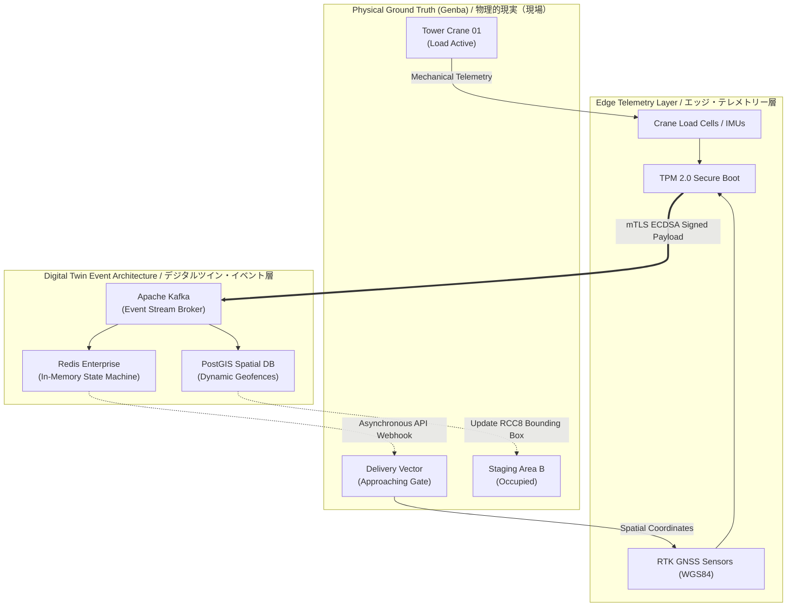

  <h1>Digital Twin Site Management</h1>
  <h3>デジタルツイン現場管理：「現場」の再設計とイベント駆動型アーキテクチャ</h3>

 

> **Metadata:**
> * **Document ID:** `MOD-03-01-DIGITAL-TWIN`
> * **Status:** 🏗️ Active Specification / 仕様確定
> * **Author:** Jericho Ong / ジェリコ・オング (Construction & Logistics DX Independent Researcher)
> * **Language:** English / Japanese (Advanced Technical Business / ビジネス技術日本語)

---

## Executive Summary / 概要

In contemporary construction technology, the term "Digital Twin" is frequently misapplied as a synonym for 3D BIM/CIM (Building Information Modeling). However, from a Systems Engineering perspective, a static 3D model is merely a high-latency spatial database. A true Digital Twin is a **Cyber-Physical State Machine**—an event-sourced architecture that continuously synchronizes the stochastic physical reality of the site (*Ground Truth*) with the cloud architecture via high-frequency telemetry. 

This document outlines the architectural transition of traditional, asynchronous site management into a deterministic, Pub/Sub IT infrastructure governed by Hybrid Automata theory.

> 現代の建設テクノロジーにおいて、「デジタルツイン」という用語はしばしば静的な3D BIM/CIM（ビルディング・インフォメーション・モデリング）の同義語として誤用されております。しかし、システムエンジニアリングの観点から見れば、静的な3Dモデルはレイテンシ（遅延）の高い単なる空間データベースに過ぎません。真のデジタルツインとは**「サイバーフィジカル・ステートマシン（状態遷移機械）」**であり、高頻度のテレメトリーを介して、確率論的な現場の物理的現実（グラウンド・トゥルース）とクラウド・アーキテクチャを継続的に同期させるイベントソーシング型アーキテクチャでございます。
> 
> 本ドキュメントでは、従来の非同期的な現場管理を、ハイブリッド・オートマトン理論によって制御される、決定論的なPub/Sub（パブリッシュ・サブスクライブ）ITインフラストラクチャへと移行させるためのアーキテクチャの青写真を描き出します。

---

## 1. The Fallacy of Static BIM / 静的BIMの誤謬とイベントソーシングへの移行

The fundamental flaw in current Construction DX initiatives is the reliance on asynchronous CRUD (Create, Read, Update, Delete) databases. A BIM model that is updated manually at the end of a shift ($t + 12$ hours) possesses massive data latency. During that 12-hour blind spot, the digital twin does not reflect the physical reality of the site. If a logistics vector (a concrete agitator truck) relies on a static BIM model to determine unloading zone availability, the system will inevitably generate thread-blocking queues—the core mechanism of the 2024 Problem.

To achieve Enterprise-grade DX, the Digital Twin must utilize an **Event-Sourced Architecture**. Instead of overriding data in a static table, every physical movement, payload drop, and machine activation on site is recorded as an immutable log event in a time-series stream.

> 現在の建設DXにおける根本的な欠陥は、非同期のCRUD（作成・読み取り・更新・削除）データベースへの依存にございます。シフトの終わりに手動で更新されるBIMモデル（$t + 12$時間）は、巨大なデータ遅延を抱えています。その12時間のブラインドスポットにおいて、デジタルツインは現場の物理的現実を反映しておりません。もし物流ベクトル（アジテータトラックなど）が、荷降ろしゾーンの空き状況を判断するために静的なBIMモデルに依存した場合、システムは必然的にスレッドをブロックする待機列（2024年問題の中核的メカニズム）を生成いたします。
> 
> エンタープライズレベルのDXを達成するためには、デジタルツインは**イベントソーシング・アーキテクチャ**を利用しなければなりません。静的なテーブルのデータを上書きするのではなく、現場でのあらゆる物理的動作、資材の配置、および重機の稼働を、時系列ストリームにおける「不変のログイベント」として記録するのです。

---

## 2. Transitioning from Asynchronous Polling to Event-Driven Pub/Sub / 非同期ポーリングからイベント駆動型Pub/Subへの移行

To successfully map civil engineering to IT systems, the architecture must eliminate legacy data synchronization methods. 

Traditional construction sites operate on **low-frequency batch updates** or manual schedule polling (e.g., daily schedule distribution or manual radio checks). In systems architecture terms, this acts as a localized, high-latency database prone to severe desynchronization between logistics nodes and the physical site.

A true Cyber-Physical System replaces this manual polling mechanism with a **Distributed Message Broker** (e.g., Apache Kafka). Heavy machinery and logistics nodes constantly *publish* their spatial coordinates and kinematic states. Sub-contractors, site managers, and incoming delivery trucks *subscribe* to these event streams, receiving zero-latency spatial updates asynchronously without requesting them.

> 土木工学をITシステムに適切にマッピングするためには、アーキテクチャから旧来のデータ同期手法を排除しなければなりません。
> 
> 従来の建設現場は、**低頻度のバッチ更新**や手動のスケジュール・ポーリング（日々のスケジュール配布や無線による手動確認など）で稼働しています。システムアーキテクチャの観点から見ると、これは物流ノードと物理的な現場との間に深刻な非同期化（デシンクロ）を引き起こしやすい、レイテンシの高いローカル・データベースとして機能します。
> 
> 真のサイバーフィジカルシステムは、この手動のポーリングメカニズムを**分散型メッセージブローカー**（Apache Kafkaなど）に置き換えます。重機や物流ノードは、自身の空間座標や運動状態を常に「パブリッシュ（発行）」します。協力会社、現場監督、および到着予定の配送トラックはこれらのイベントストリームを「サブスクライブ（購読）」し、リクエストを送信することなく、空間的な更新情報を非同期かつゼロレイテンシで受け取るのです。

---

## 3. The Hybrid Automata Execution Pipeline / ハイブリッド・オートマトン実行パイプライン

To transition the site from stochastic chaos to deterministic predictability, the Digital Twin utilizes the Hybrid Automata Model defined in CPAL. Continuous physical variables (GPS coordinates) trigger discrete state transitions within the cloud infrastructure.

Given a spatial zone $Z_1$, the discrete state transition function $R$ is triggered by an edge-telemetry event $e$:

$$q_{t+1} = R(q_t, e) \quad \text{where} \quad e \in \text{Kafka Topic: } \texttt{site.telemetry.zone1}$$

If a crane enters a geofenced lift zone, the continuous physical coordinate breaches the boundary invariant ($\text{Inv}$), triggering a discrete state shift from `STATE_IDLE` to `STATE_LIFT_ACTIVE`. This state change propagates through Kafka, instantly locking the zone and rerouting any incoming delivery trucks via Just-In-Time API webhooks.

> 現場を確率論的な混沌から決定論的な予測可能性へと移行させるため、デジタルツインはCPALで定義された「ハイブリッド・オートマトン・モデル」を利用します。連続的な物理変数（GPS座標など）が、クラウドインフラ内での離散的な状態遷移をトリガーします。
> 
> 空間ゾーン $Z_1$ において、離散状態遷移関数 $R$ は、エッジ・テレメトリー・イベント $e$ によってトリガーされます。クレーンがジオフェンスで囲まれた吊り上げゾーンに進入すると、連続的な物理座標が境界不変条件（$\text{Inv}$）を破り、`STATE_IDLE`（待機）から `STATE_LIFT_ACTIVE`（吊り上げ稼働中）への離散的な状態シフトがトリガーされます。この状態変化はKafkaを通じて伝播し、即座に該当ゾーンをロックダウンさせ、JIT（ジャスト・イン・タイム）APIのWebhookを介して到着予定のトラックを別ルートへ誘導（リルート）いたします。

---

## 4. Operational State Mapping Lexicon / 運用状態マッピング語彙集

To programmatically execute this Digital Twin, physical site conditions must be constrained to explicit enumerations (`Enums`) within the software architecture. Below is the formal mapping data dictionary, translating stochastic physical reality into deterministic, automated data flows.

> このデジタルツインをプログラムで実行するためには、物理的な現場の状況をソフトウェアアーキテクチャ内の明示的な列挙型（`Enums`）に制約しなければなりません。以下は、物理的な現実を自動化されたデータフローへと変換する、本アーキテクチャの本質的なデータディクショナリ（語彙集）でございます。

| Physical Site Condition **(物理的な現場状況)** | Digital State Transition (`Enum`) **(デジタル状態遷移)** | Algorithmic Consequence **(アルゴリズムによる実行結果)** |
| :--- | :--- | :--- |
| **Machinery Idle / Engine Off** 重機待機中・エンジン停止 | `STATE_OFFLINE` | **Telemetry Ingestion Invalidation:** Logistics routing APIs are instantly notified that the physical asset is offline and unavailable for inbound unloading sequences. |
| **Tamagake (Slinging / Rigging)** 玉掛け作業中 | `STATE_EXECUTING_CRITICAL` | **Dynamic Spatial Lockout:** The surrounding 3D geofence volume is instantly locked. All intersecting inbound vectors are dynamically rerouted to external buffer coordinates. |
| **Zone Cleared / Material Dropped** 資材配置完了・エリア解放 | `STATE_ZONE_RELEASED` | **Asynchronous Token Propagation:** Triggers a non-blocking webhook to the next supply chain node, generating and issuing a cryptographically signed gate-pass token for the next scheduled vehicle. |
| **Kyoufuu (High Wind Limit)** 悪天候・強風作業制限 | `STATE_ENVIRONMENTAL_LOCK` | **Global Constraint Propagation:** Triggers an automatic site-wide safety override. The cloud predictive GNN layer recalculates all upstream ETAs mathematically, removing human communication latency. |

---

## 5. Cyber-Physical State Machine Topology / サイバーフィジカル・ステートマシン・トポロジー

The following topology dictates how physical asset behaviors are serialized into digital events, processed by the Twin, and utilized to algorithmically control site logistics without human intervention.

> 以下のトポロジーは、物理的資産の挙動がどのようにデジタルイベントにシリアライズされ、デジタルツインによって処理され、人間の介入なしにアルゴリズムによって現場の物流を制御するかを規定するものでございます。

---

## 6. Architectural Insights: The Prerequisite for Physical AI / アーキテクチャの洞察：物理AIの前提条件

By completely decoupling site management from human-mediated heuristics and transitioning to a mathematically verifiable Cyber-Physical State Machine, the construction site ceases to be a chaotic physical environment. It becomes a deterministic, queryable edge-computing node.

This architectural foundation is not merely a digitization of existing workflows; it is the **mandatory prerequisite for Physical AI and autonomous robotics**. AGI-driven humanoids and autonomous heavy machinery cannot operate safely within environments governed by analog whiteboards, morning assemblies, and manual radio checks. By establishing strict topological rules and zero-latency event streaming today, the CPAL framework lays the absolute groundwork for the fully autonomous, self-correcting construction ecosystems of 2030.

> 人間の判断を介在するヒューリスティックから現場管理を完全に切り離し、数学的に検証可能なサイバーフィジカル・ステートマシンへと移行することで、建設現場はもはや無秩序な物理環境ではなくなります。それは決定論的でクエリ可能なエッジ・コンピューティング・ノードへと変貌を遂げます。
> 
> このアーキテクチャ基盤は、既存のワークフローの単なるデジタル化ではなく、**物理AIおよび自律型ロボティクスの導入において不可欠な前提条件**となります。AGI駆動のヒューマノイドや自律型重機は、アナログなホワイトボードや朝礼、無線確認によって管理される環境下では安全に稼働できません。厳格なトポロジー・ルールとゼロレイテンシのイベントストリーミングを今日確立することにより、CPALフレームワークは2030年の完全自律型建設エコシステムに向けた絶対的な土台を構築いたします。

***

  
<strong>[ SYSTEM ARCHITECTURE BLUEPRINT // MOD-03-01 ]</strong>

---

## 7. Conclusion & Strategic Directives / 結論および戦略的指針

### 7.1 Architectural Purpose & Real-World Contribution / 目的と実社会への貢献

The architectural blueprint delineated in this document transcends theoretical digitalization; it proposes a fundamental paradigm shift from asynchronous, heuristic-based construction management to a mathematically verifiable, event-driven Cyber-Physical System. The ultimate purpose is the eradication of stochastic latency—the root cause of the "2024 Logistics Problem"—and the establishment of deterministic site operations. 

In real-world applications, this infrastructure bridges the gap between static 3D BIM models and dynamic, sentient job sites. It facilitates the safe, concurrent deployment of autonomous heavy machinery, UAVs, and a human workforce by governing spatial overlap through zero-latency, cryptographically verified states. This contributes directly to a zero-fatality safety ecosystem and radically reduces carbon emissions by eliminating localized supply-chain bottlenecks and engine-idle times.

> 本文書にて詳述いたしましたアーキテクチャの青写真は、単なる理論的なデジタル化の域を超え、非同期かつ経験則に基づく従来の建設現場管理から、数学的に検証可能なイベント駆動型サイバーフィジカルシステムへの根本的なパラダイムシフトを提唱するものでございます。その究極の目的は、「2024年物流問題」の根本原因である確率論的な遅延（レイテンシ）を根絶し、決定論的な現場運用を確立することに他なりません。
> 
> 実社会への貢献といたしまして、本インフラストラクチャは、孤立した静的3D BIMモデルから、動的かつ自律的な現場環境への完全な移行を実現いたします。ゼロレイテンシかつ暗号学的に検証された状態管理によって空間的競合を制御することで、自律型重機、UAV（無人航空機）、そして人間の作業員が極めて安全かつ同時に稼働できる環境を構築いたします。これは「死亡事故ゼロ」の安全エコシステムに直接貢献するだけでなく、現場レベルのサプライチェーンのボトルネックと重機の待機（アイドリング）時間を排除することで、二酸化炭素排出量の大幅な削減をもたらすものでございます。

### 7.2 Value Proposition for Enterprise Stakeholders / 企業経営層およびステークホルダーへのビジネス価値

For enterprise stakeholders, general contractors (Zenekon), and prospective technology partners, the adoption of this architecture translates to mathematically guaranteed Service Level Agreements (SLAs). The transition from manual coordination to API-driven orchestration eliminates idle wait times and optimizes capital expenditure (CapEx) on logistics vectors. 

Furthermore, this framework provides a highly scalable, future-proof edge-computing foundation. It transforms a construction company into a technology-driven logistics hub, which is an indispensable evolution for corporate survival and global competitiveness in an era facing severe human labor shortages.

> 企業の経営層、ゼネコン各社様、および将来のテクノロジー・パートナーの皆様にとって、本アーキテクチャの導入は、数学的に保証されたSLA（サービス品質保証）の達成を意味いたします。手動による調整業務からAPI主導のオーケストレーションへ移行することで、無駄な待機時間を完全に排除し、物流ベクトルに対する資本的支出（CapEx）を劇的に最適化いたします。
> 
> さらに、本フレームワークは、極めて拡張性が高く、将来の技術革新を見据えたエッジ・コンピューティング基盤を提供いたします。それは、建設企業を「テクノロジー主導の物流ハブ」へと変貌させるものであり、深刻な労働力不足に直面する現代において、企業の存続とグローバルな競争力を維持するために不可欠な進化でございます。

### 7.3 Strategic Recommendations / 戦略的提言

To achieve this Cyber-Physical integration, organizations are highly advised to execute the following strategic directives:
1. **Deprecate Legacy DB Polling:** Immediately transition from CRUD-based spatial databases to Append-Only Event Streams for site logistics.
2. **Deploy Distributed Message Brokers:** Integrate real-time event streaming protocols (e.g., Apache Kafka / MQTT) directly at the site's edge-computing layer.
3. **Elevate Human Capital:** Transition traditional Site Managers (Genba Kantoku) into Systems Orchestrators, capable of reading and managing automated data flows.
4. **Invest in Physical AI Integration:** Standardize all machinery APIs now to prepare for the deployment of Artificial General Intelligence (AGI) and humanoid robotics within the next decade.

> この高度なサイバーフィジカル統合を達成するため、各組織におかれましては、以下の戦略的指針を実行に移されることを強く推奨申し上げます。
> 1. **レガシーなDBポーリングの廃止:** 現場の物流管理において、従来のCRUDベースの空間データベースから、追記型のイベントストリーム（Append-Only Event Streams）へ即時移行すること。
> 2. **分散型メッセージブローカーの導入:** Apache KafkaやMQTTなどのリアルタイム・イベント・ストリーミング・プロトコルを、現場のエッジ・コンピューティング層に直接統合すること。
> 3. **人的資本の高度化:** 従来の現場監督を、自動化されたデータフローを解読し管理できる「システム・オーケストレーター」へと役割を転換・育成すること。
> 4. **物理AI（Physical AI）統合への投資:** 今後10年以内のAGI（汎用人工知能）およびヒューマノイド・ロボットの導入を見据え、現在稼働しているすべての重機・機材のAPIを標準化すること。

***

  
<strong>[ SYSTEM ARCHITECTURE BLUEPRINT // MOD-03-01 // END OF DOCUMENT ]</strong>

